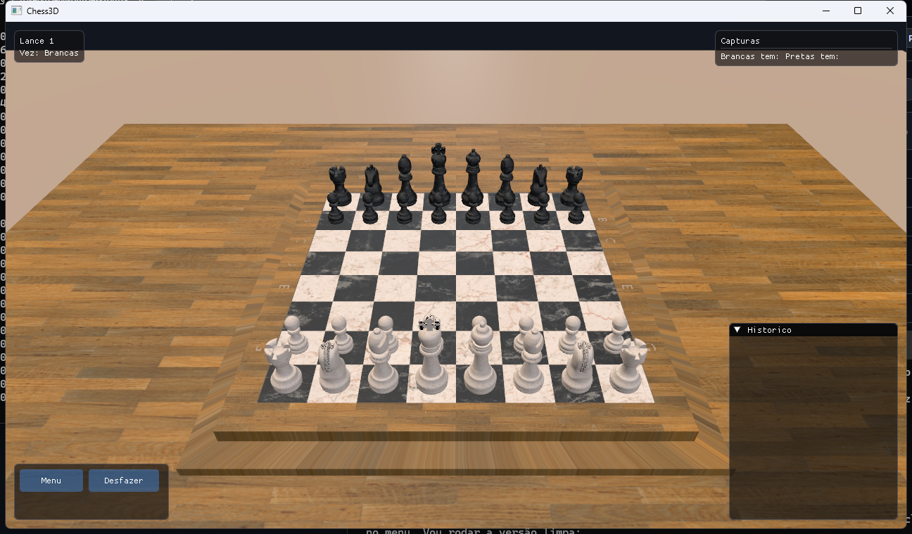
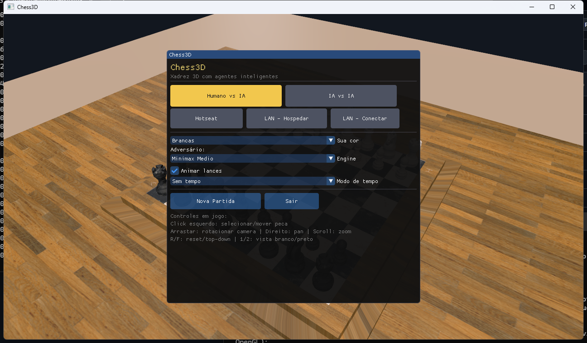

<!--
Slides em formato Marp (https://marp.app). Para exportar:
  npx @marp-team/marp-cli docs/APRESENTACAO.md --pdf
  npx @marp-team/marp-cli docs/APRESENTACAO.md --pptx
No GitHub, este arquivo também lê bem como documento normal.
-->

# ♟️ Chess3D

### Xadrez 3D em C++ com agentes inteligentes

**Programação com Agentes** — UFPB/CIn
Deivison Costa

`OpenGL 4.6` · `C++20` · `Minimax α-β` · `Stockfish / Berserk` · `LAN`

---

## O que é

Um jogo de **xadrez 3D** completo, com:

- **Engine de xadrez própria** (regras completas, validada por *perft*)
- **Agente inteligente** Minimax em 3 níveis + engines externas (Stockfish, Berserk)
- Renderização 3D moderna, animações e UI



---

## Funcionalidades

- ♜ **3D** com câmera orbital, materiais PBR e iluminação
- 🤖 **IA Minimax** (Fácil / Médio / Difícil) + **Stockfish 18 / Berserk 14** via UCI
- 🎬 **Animações**: cavalo em arco, captura com *fade*, queda do rei no mate
- 🌐 **Multiplayer LAN**, **hotseat** e **humano × IA**
- ⏱️ **Relógio** (blitz/rápido), promoção, desfazer, histórico
- 🖱️ **Picking 3D** com destaque de movimentos legais



---

## Stack tecnológico

| Camada | Tecnologias |
|---|---|
| Linguagem | **C++20** |
| Gráficos | **OpenGL 4.6 Core** (Direct State Access, KHR_debug) |
| Janela/Input | **GLFW 3** + **glad** |
| Matemática | **glm** |
| Modelos/Texturas | **tinygltf** (`.glb`) + **stb_image** |
| UI | **Dear ImGui** |
| Log / Testes | **spdlog** / **Catch2** |
| Build / Deps | **CMake + Ninja** / **vcpkg** |
| Rede | **TCP** (Winsock / POSIX) |
| CI/CD | **GitHub Actions** |

---

## Arquitetura

```
        app (Application · Window · GameSession · Headless)
   ┌──────────┬──────────┬──────────┬──────────┬──────────┐
 render/anim   ui (ImGui)  input      net (LAN)   ai
 Shader·Mesh   GameUi      Input-     LanConn·    Minimax·Evaluator
 Camera·Picker             Handler    Protocol    Uci/RemoteAgent
 GltfLoader·Animator                              EngineCatalog
   └──────────────────────────┬───────────────────────────┘
              chess (engine pura: Board · MoveGen · Rules)
```

> A **engine de xadrez** não conhece OpenGL nem UI → testável isoladamente e
> reaproveitada no modo headless.

---

## O agente inteligente

- **Negamax com poda α-β** + ordenação **MVV-LVA**
- **Iterative deepening** com limite de tempo + **quiescence search**
- Avaliação: **material + tabelas posicionais (PST) + mobilidade**
- Níveis: Fácil (depth 2) · Médio (depth 4) · Difícil (depth 6, 3 s)
- **Bônus:** Stockfish/Berserk plugados como subprocesso **UCI**

**Impacto da poda** (depth 4, posição inicial):
`206.603 nós → 5.425 nós` &nbsp;≈&nbsp; **38× mais rápido**

---

## Construído **com** um agente de IA 🤖

O projeto foi desenvolvido em parceria com o **Claude Code** — fechando o tema da cadeira.

Desenvolvimento **incremental por fases**, com **validação objetiva** em cada uma:

- Engine → conferida por **perft** (20 / 400 / 8902 / 197281 …)
- IA → métrica de **poda ~38×** + testes (mate em 1/2, lance sempre legal)
- Jogo → **smoke test headless** + *interop* LAN entre processos
- Distribuição → binários auto-contidos que **rodam sem instalar nada**

---

## Demo & Download

**Baixe e jogue (sem instalar):**
➡️ github.com/Deivison-Costaa/chess3d/releases/tag/**v0.1.0**

- 🪟 **Windows:** `chess3d-windows-x86_64.exe` — duplo-clique
- 🐧 **Linux:** `chess3d-x86_64.AppImage` — `chmod +x` e executar

Tudo embutido (assets + engines). Gerado automaticamente pelo **GitHub Actions** a cada tag.


---

## Destaques técnicos

- ♟️ Engine própria **validada por perft** (não "parece certo" — é exato)
- ⚡ OpenGL **4.6 com DSA** (API moderna, sem estado global)
- 🧠 Agente clássico **bem fundamentado** (α-β, PST, quiescence)
- 🔌 Arquitetura **plugável** (Minimax interno ou engine UCI por lado)
- 🌍 **Cross-platform** (Windows + Linux) com **CI/CD** completo
- 📦 **Binários auto-contidos** (`.exe` auto-extraível / AppImage)

---

# Obrigado! ♟️

**Repositório:** github.com/Deivison-Costaa/chess3d
**Releases:** github.com/Deivison-Costaa/chess3d/releases/tag/v0.1.0
**Documentação técnica:** [`docs/ARQUITETURA.md`](ARQUITETURA.md)

*Chess3D — Programação com Agentes · UFPB/CIn*
